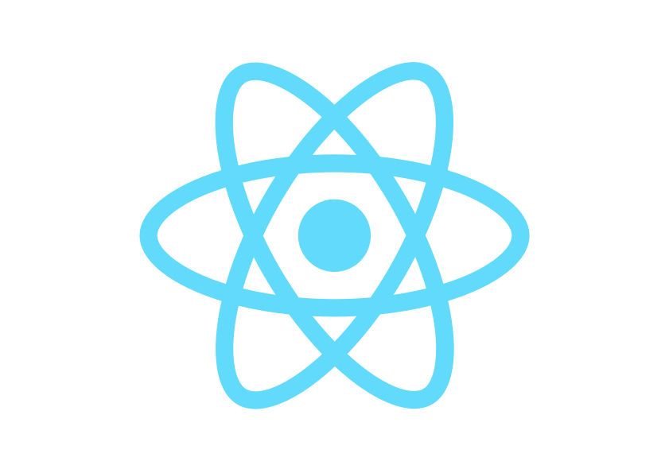

 [`https://abisekh.ml`](https://abisekh.ml)

&nbsp;

&nbsp;

&nbsp;

&nbsp;

&nbsp;

&nbsp;

&nbsp;
### Hi, I'm Abisekh Subedi, a `Front-End designer/developer` from Nepal.
<!-- - 🔭 I’m currently working [untitled] -->
- 🌱 I’m currently learning [UI/UX](https://www.coursera.org/specializations/michiganux) and Front-end development.
- 🔎 I’m looking for new challenges to improve as a Designer & Developer.
    - Challenges I do to improve myself, [link](#).
- 💬 Ask me about anything [here](https://linkedin.com/in/abisekh-subedi-3871841ab).

I have my own YouTube channel where I make videos—tutorials related to design, UI/UX & front-end dev. Also, I do write, occasionally, once a month. Visit my [blog](https://abisekh.ml/blog).  
Check out my channel! If you liked what I did. Please consider [subscribing](https://www.youtube.com/channel/UCoMd0uAhsbE71riSBX8aiMg).
&nbsp;

### Languages and Tools that I use:

 
  &nbsp;

  &nbsp;
 
 
   
    &nbsp;
  
 &nbsp;

&nbsp;

  &nbsp;

  &nbsp;

  &nbsp;

Thank you for visiting my profile and I'd love to [connect](https://linkedin.com/in/abisekh-subedi-3871841ab) with you on linkedin! 

If you want to see what I'm up to, I frequent instagram. 👉 [instagram](https://instagram.com/abisekhsubedi).

